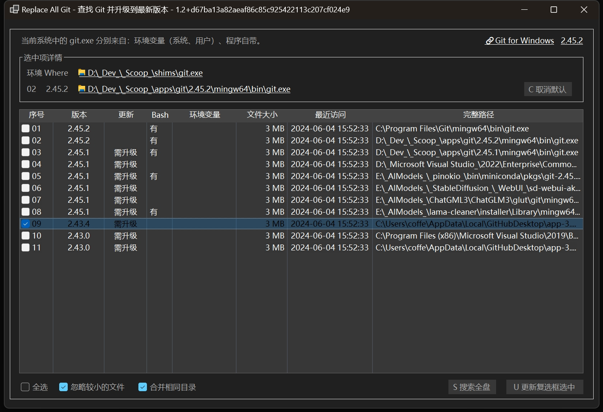

# ReplaceAllGit 简要说明 Brief Explanation

> 采用机器翻译，敬请谅解。
> 
> Machine translation is used, please understand.

Git 安全漏洞问题需升级所有 Git.exe。此工具用于查找本地硬盘上所有的 Git 并获取版本信息，批量更新（复制、创建软链接）。

This tool is used to find all Git on the local hard disk and obtain version information, and then update in batches (copy, create soft links).

# 起因：Git 远程代码执行漏洞 CVE-2024-32002

# May 2024 CVE Security Bulletin: CVE-2024-32002

# Git: Remote code execution vulnerability

2024年5月 CVE 安全通告：**Git 远程代码执行漏洞 (CVE-2024-32002)**

 **漏洞编号**：QVD-2024-18126, CVE-2024-32002

> + **漏洞描述 Vulnerability Description**
> 
> > Git 在支持符号链接的不区分大小写的文件系统上的递归克隆容易受到大小写混淆的影响，未经身份验证的攻击者可以利用漏洞使受害者克隆操作期间执行克隆的代码，导致远程代码执行。
> > 
> > Git is vulnerable to case confusion on case-insensitive filesystems that support symbolic links when performing recursive clones. Unauthenticated attackers can exploit this vulnerability to execute cloned code during the victim's clone operation, leading to remote code execution.
> 
> + **CVE 编号 Number**
> 
> CVE-2024-32002
> 
> + **影响版本 Affected Version**
>   
>   + Git 2.45.0
>   
>   + Git 2.44.0
>   
>   + Git 2.43.* < 2.43.4
>   
>   + Git 2.42.* < 2.42.2
>   
>   + Git 2.41.0
>   
>   + Git 2.40.* < 2.40.2
>   
>   + Git < 2.39.4
>     
>     只影响 Windows 和 Mac 系统。
>     
>     Only affects Windows and Mac systems.
> 
> **漏洞详情 Vulnerability Details**
> 
> POC：[https://github.com/amalmurali47/git_rce]([GitHub - amalmurali47/git_rce: Exploit PoC for CVE-2024-32002](https://github.com/amalmurali47/git_rce))

# ——Hurry up and upgrade to fix the vulnerability.

# ——抓紧升级修复漏洞

**Git 2.45.1 版本修复了相关漏洞，抓紧升级即可。**

**The related vulnerability has been fixed in Git version 2.45.1, please upgrade promptly.**

然而，非常麻烦的事情来了——系统中有多个 `git.exe`：

1. 采用标准安装程序安装的 `Git for Windows`

2. 采用 `scoop` 等工具安装的 `Git`，

3. 某些软件、项目自带的 `git`

——分散在各个位置，非常混乱。

> 当然，也可以不予理会，不升级它们。

However, a very troublesome issue has arisen - there are multiple `git.exe` in the system:

1. `Git for Windows` installed with the standard installer

2. `Git` installed with tools like `scoop`

3. `git` that comes with certain software or projects

——They are scattered in various locations, which is very chaotic.

> Of course, you can also ignore them and not upgrade them.

# 一个查找和批量升级 Git 的小工具

# A small tool for finding and batch upgrading Git

周末，带小朋友写了这个小工具，其中一些稍微复杂的部分是我帮助写的，也采用了两个开源项目的代码（MIT 协议），非常感谢！

Over the weekend, I wrote this small tool with my kid. I helped with some of the slightly more complex parts, and we also used code from two open-source projects (under the MIT license). Many thanks!

+ **EverythingSharp**: [GitHub - Riboe/EverythingSharp: A simple C# wrapper around the Everything SDK from Voidtools.](https://github.com/Riboe/EverythingSharp)
  
  —— A simple C# wrapper around the [Everything SDK](https://www.voidtools.com/support/everything/sdk/) from Voidtools.

+ **Dark-Mode-Forms**: [GitHub - BlueMystical/Dark-Mode-Forms: Apply Dark Mode to all Controls in a Form [WinForms]](https://github.com/BlueMystical/Dark-Mode-Forms)
  
  —— Apply Dark Mode to all Controls in a Form [WinForms]

# 

# 运行环境 Running Environment

+ .NET 8 运行环境 Runtime
  
  + .NET Desktop Runtime 8.0.6 [下载 .NET 8.0 Desktop Runtime (v8.0.6) - Windows x64 Installer](https://dotnet.microsoft.com/zh-cn/download/dotnet/thank-you/runtime-desktop-8.0.6-windows-x64-installer)
    
    或 or
  
  + [下载 .NET 8.0 (Linux、macOS 和 Windows)](https://dotnet.microsoft.com/zh-cn/download/dotnet/8.0)、[Download .NET 8.0 (Linux, macOS, and Windows)](https://dotnet.microsoft.com/en-us/download/dotnet/8.0)

+ Everything 安装并运行
  
  + https://www.voidtools.com/

# 版本计划 Version Plan

* [ ] V1.0 仅提供查找功能，基于 Everything
  
  * [x] 基本功能
  
  * [x] 提供深色模式风格，跟随系统设置、用户自行选择
  
  * [ ] 没有安装 Everything 时，采用文件搜索的方式
  - [ ] 加入多语言支持，英语
- [ ] V2.0 提供复制功能
  
  * 备份指定版本
  
  * 用最新版本覆盖指定版本
  
  * 恢复备份
* V2.x 提供软链接映射功能
  
  * 备份指定版本
  
  * 用软链接映射到最新版本
  
  * 恢复备份

* V3.x 采用 WPF、MAUI，学习、练手

这是一个学习、练习项目，但基类可用于解决其它类似问题，例如：

+ 查找系统里的 python.exe，并确定版本、升级、合并（软链接）

+ 查找系统里的各种 AI 模型，并确定版本、升级、合并（软链接）——例如 SDWebUI、ComfyUI、Fooocus、SD Forge 等等，OLlama、LMStudio 等等的模型等。

# Version Plan

- [ ] V1.0 Only provides search function, based on Everything
  
  - [x] Basic function
  
  - [x] Provide dark mode style, follow system settings, user's choice
  
  - [ ] Use file search when Everything is not installed
  
  - [ ] Add multi-language support, English

- [ ] V2.0 Provides copy function
  
  - Backup specified version
  
  - Overwrite specified version with the latest version
  
  - Restore backup

- V2.x Provides soft link mapping function
  
  - Backup specified version
  
  - Map to the latest version with soft link
  
  - Restore backup

- V3.x Use WPF, MAUI to learn and practice

This is a learning and practice project, but the base class can be used to solve other similar problems, such as:

- Find python.exe in the system, and determine the version, upgrade, merge (soft link)

- Find various AI models in the system, and determine the version, upgrade, merge (soft link) - for example, SDWebUI, ComfyUI, Fooocus, SD Forge, etc., OLlama, LMStudio models, etc.
